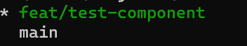
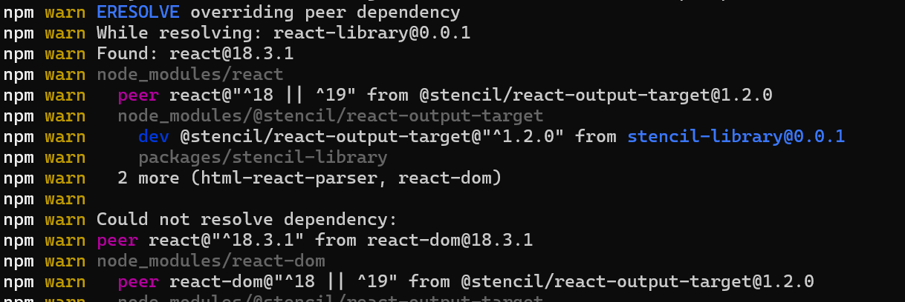
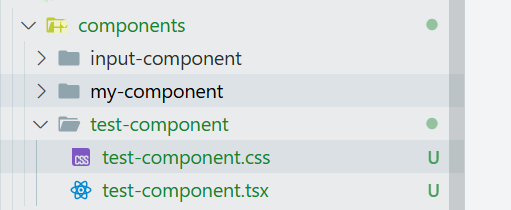
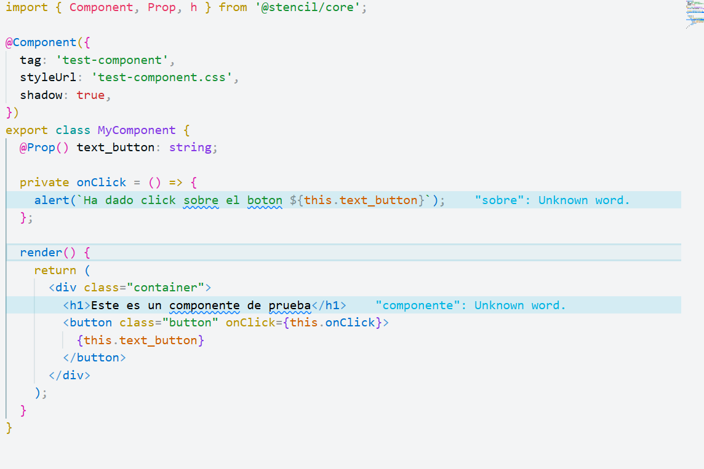
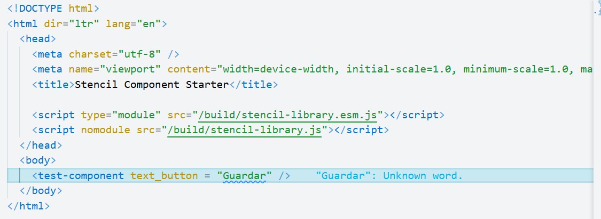
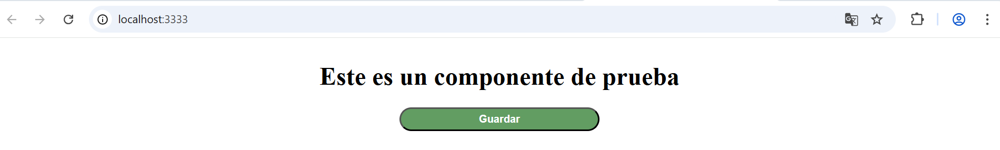
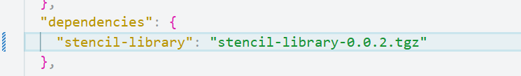
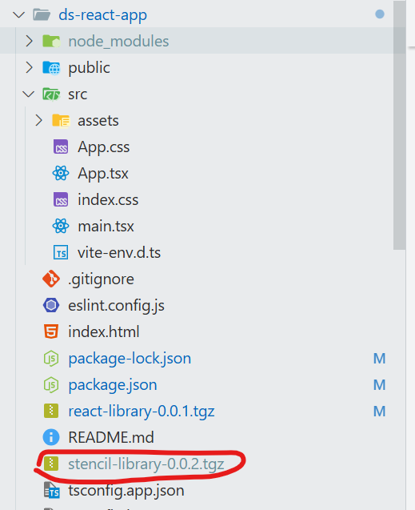
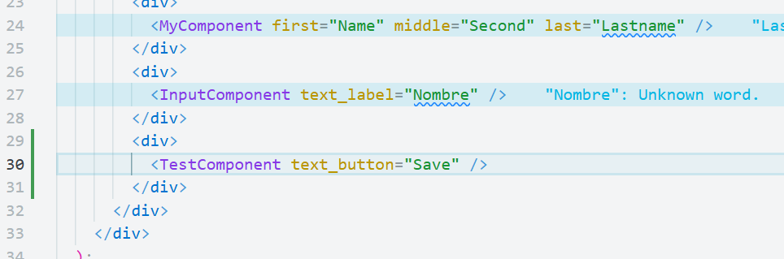

# Pasos para configurar el repositorio

## paso 1:

Clonar el repo de la siguiente ruta: **https://github.com/Celula-Micro-Frontends/ds-stencil-react-monorepo**

## paso 2

Ir al repositorio del paso anterior y crear una nueva rama y ubicarse en ella en su repositorio local como se muestra en la siguiente imagen

## paso 3:

Se usa lerna como gestor de paquetes, para mas información visitar: **https://lerna.js.org/**

Se debe ubicar en la carpeta raiz del monorepo e instalar las dependencias con el siguiente comando: **npm install**

En caso de salir el siguiente error ejecutar el siguiente comando **npm install --legacy-peer-deps**

## paso 4:

Para crear un nuevo web component se debe ubicar en la ruta /packages/stencil-library/src/components y crear su propia carpeta con el componente

## paso 5

Para correr el proyecto de stencil se ejecuta el comando **npm start** sobre el proyecto packages/stencil-library y luego se debe realizar la creación de componente.

## paso 6

una vez realizado el componente como se muestra a continuacion

llamar el componente en el archivo index.html como se muestra en la siguiente imagen

Este seria el resultado final del componente **test-component**

## paso 7

Para probar el componente en una aplicacion de react ejecutar en la ruta del proyecto stencil-library el siguiente comando **npm run build**

## paso 8

En el archivo package.json canbiar la version ejemplo **"version": "0.0.2"**

## paso 9

En el proyecto react-library cambiar la version de la libreria  **"stencil-library": "^0.0.2"** por la version generada

## paso 10

ejecutar de nuevo el comando npm install

## paso 11

luego de instalado la nueva version de la libreria **stencil-library** sobre el proyecto **react-library** ejecutamos el comando **npm run build** y con esto finalizamos la creación del web component migrado a un componente de react.

# Pasos para probar el componente generado

## importante

Se debe tener una version de node de 20 o superior para poder probar el componente

## paso 12

luego de ejecutar el **npm run build** sobre el proyecto **stencil-library** se debe borrar el siguiente archivo **react-library-0.0.1.tgz** y se ejecuta el comando **npm pack** u otra opción es cambiar la versión del proyecto **stencil-library**

## paso 13

clonamos el siguiente proyecto **https://github.com/Celula-Micro-Frontends/ds-react-app**, en caso de necesitar subir la prueba del componente sobre el proyecto se debe realizar el paso 2 sobre el proyecto **ds-react-app**

## Importante

Si se cambia la version del proyecto **stencil-library** se debe ejecutar el comando **npm pack** y copiar el archivo generado en el proyecto **ds-react-app** como se muestra a continuacion

## paso 14 

En el proyecto **ds-react-app** se debe borrar el archivo **react-library-0.0.1.tgz** y luego se remplaza por el archivo que se generó en el proyecto **react-library**

En la raiz del proyecto **ds-react-app** se debe eliminar la carpeta **node_modules** y el archivo **package-lock.json** y se debe ejecutar el comando **npm install**

## paso 15

En el archivo app.tsx importar el componente que se generó en los pasos anteriores como se muestra a continuacion

## paso 16

por ultimo ejecutamos el comando **npm run preview** y ya se puede observar el componente creado